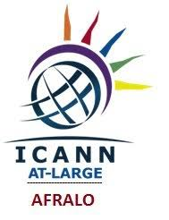

# 🤖 GEMINI ENTERPRISE — ADVANCED
### Interactive Comic by Gbemisola Esho

  <a href="https://Apinke.github.io/gemini-enterprise-advanced/"><strong>▶ Read the Live Comic</strong></a> &nbsp;·&nbsp;
  <a href="https://github.com/Apinke/gemini-enterprise-advanced/fork">Fork this repo</a> &nbsp;·&nbsp;
  <a href="#license">License</a>

---

## About

14-chapter advanced comic covering Gemini Enterprise governance frameworks, security architecture, compliance, VPC-SC, Agent Registry, semantic policies, and enterprise-scale deployment patterns. For security architects, platform engineers, and enterprise AI leads.

---

## 📖 Chapters

| Ch | Title |
|---|---|
| 1 | Enterprise Architecture Deep Dive |
| 2 | VPC Service Controls & Network Security |
| 3 | Agent Registry & Lifecycle Management |
| 4 | Semantic Policy Engine |
| 5 | Data Residency & Sovereignty |
| 6 | CMEK & Key Management |
| 7 | Audit Logging & Compliance |
| 8 | Zero Trust for AI Agents |
| 9 | Multi-Region Deployment |
| 10 | Disaster Recovery & Resilience |
| 11 | FinOps for Gemini Enterprise |
| 12 | Regulatory Compliance Framework |
| 13 | Red Team & AI Security Testing |
| 14 | Enterprise Maturity Model |

---

## 🌐 Live Demo

👉 **[https://Apinke.github.io/gemini-enterprise-advanced/](https://Apinke.github.io/gemini-enterprise-advanced/)**

Features:
- 🔄 Flip each page for key lessons
- ← → Buttons, arrow keys, or swipe to navigate
- 📋 Table of Contents
- 📊 Progress bar · Mobile friendly

---

## 📚 Full Series by Gbemisola Esho

| Series | Repos |
|---|---|
| 🤖 Gemini Enterprise | [Beginner](https://github.com/Apinke/Gemini-Enterprise-comic) · [Intermediate](https://github.com/Apinke/gemini-enterprise-intermediate) · [Advanced](https://github.com/Apinke/gemini-enterprise-advanced) |
| 🎣 Don't Get Hooked! | [Beginner](https://github.com/Apinke/dont-get-hooked) · [Intermediate](https://github.com/Apinke/phishing-decoded) · [Advanced](https://github.com/Apinke/phishing-advanced) |

---

## 📝 License 

Licensed under [CC BY 4.0](http://creativecommons.org/licenses/by/4.0/) — free to share and adapt with attribution to **Gbemisola Esho**.

---

## 👩🏾‍💻 About the Author

**Gbemisola Esho** — Google Developer Expert (GDE), WTM Ambassador, founder of [Connectobridge](https://connectobridge.com).
*Produced in association with AFRALO / ICANN At-Large.*

